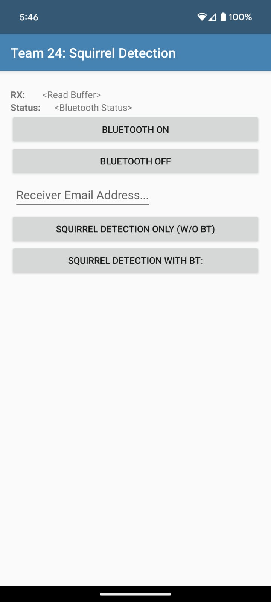
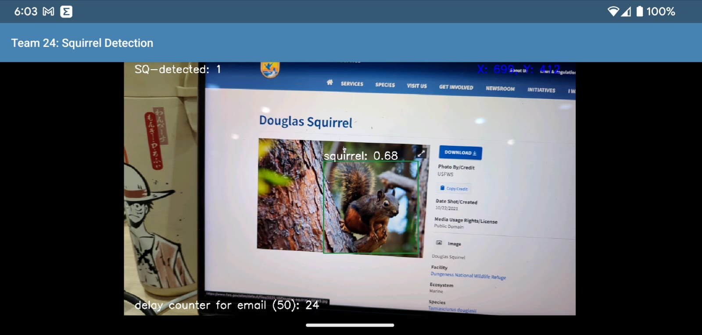

# Android Squirrel Image Detection and Alert

This project was developed during the CEE575 - Sensors, Data, and Smart Systems course as a self-directed project by *Team: Muhammad Bahru Sholahuddin and Sion Stefano Pizzi*. The application implements YOLO (You Only Look Once) for squirrel detection, with Bluetooth connectivity to send alerts.

## Descriptions, Features, and Notes

- Inspired by [matteomedioli's AndroidObjectDetection](https://github.com/matteomedioli/AndroidObjectDetection/tree/master) project.
- The dataset consists of 1,810 squirrel images obtained from [Google APIs](https://storage.googleapis.com/openimages/web/index.html) and can be accessed [here](https://drive.google.com/drive/folders/1cCxD1ne8TSRU_cIFztHMSvqJe8tCXZYy).
- A Google Drive containing the project for training and testing the dataset is [available here](https://drive.google.com/drive/folders/1ubJGx2rCKnVPiIUr1tKKaj6m0wJ7Uh23?usp=sharing).
- The training and testing process is documented in a Jupyter notebook file, which can be found [here](https://drive.google.com/file/d/1olUG9i1oi2OnLeqqDCqGzXb3OvzfGdRJ/view?usp=sharing).
- You can find the trained model's `.weights` data [here](https://drive.google.com/drive/folders/1Uldc-ucCDkC-4_5Gg3mxYE1WWziDdcQd?usp=sharing) and the configuration `.cfg` files [here](https://drive.google.com/drive/folders/1LZfTID4Hw1cUR6bS0MXiKCF8eKkB5259?usp=sharing).
- The application integrates email, Bluetooth, and IFTTT IoT services to send alerts to the Sparkfun Photon RedBoard microcontroller via a Bluetooth module using UART. The microcontroller code is written in the [Particle Web IDE](https://build.particle.io/) and can be viewed [here](https://drive.google.com/file/d/1-0iOiCAIiK7cVbWnRKW6E6bXcnsTDLaQ/view?usp=sharing).
- The system diagram can be viewed below:
  
  

## Project Structure

The essential folders and files are structured as follows:

    .
    ├── app                                                               
    │   ├── src                                                            # The main directory for the source files.
    │   │   ├── main                                                       # Contains the primary code and resources.
    │   │   │   ├── AndroidManifest.xml                                    # Configures the app's name, icon, and permissions.
    │   │   │   ├── res                                                    # Resources folder containing layouts and other UI elements.
    │   │   │   │   ├── layout                                             # Holds XML front-end files defining the user interface.
    │   │   │   │   │   ├── activity_bluetooth.xml                         # XML layouts for XML layout for Bluetooth interface.
    │   │   │   │   │   ├── activity_main.xml                              # XML layout for main activity.
    │   │   │   ├── java/com/mbsbahru/team24                               # Java back-end source code directory.
    │   │   │   │   │   │   ├── BTConnectActivity.java                     # Bluetooth connection handling.
    │   │   │   │   │   │   ├── ConnectedThread.java                       # Thread for Bluetooth communication.
    │   │   │   │   │   │   ├── DeviceInfoModel.java                       # Model for device information.
    │   │   │   │   │   │   ├── MainActivity.java                          # Main activity of the app.
    └── ...

## Android Studio Setup

Download Android Studio IDE [here](https://developer.android.com/studio?gad_source=1&gclid=CjwKCAjw26KxBhBDEiwAu6KXt9xJpCalnDTE7JICAHzDQWsQN_PKbyNYdl6o0rNav8LPQDlxV7bteRoCXh4QAvD_BwE&gclsrc=aw.ds). The app can be built using either Java or Kotlin for the back-end, and XML for the front-end.

## Dependencies

This application requires the following library to run in Android Studio:
- OpenCV 4.1.0, which can be explored [here](https://opencv.org/releases/page/4/) or directly downloaded [here](https://sourceforge.net/projects/opencvlibrary/files/4.1.0/opencv-4.1.0-android-sdk.zip/download).

## Installations

### Building and Developing the Project Files

1. Download or clone the repository.
2. Open the `squirrel-detection-android` project in Android Studio and click "Trust Project."
3. In the Menu Bar, select:\
   **Build** → **Rebuild Project**.
4. If the build is successful:
   - On your Android device, enable USB debugging:\
     **Settings** → **About phone** → tap **Build number** 7 times → allow developer mode → return to **Settings** → **Systems** → **Developer options** → turn on **USB debugging**.
   - Connect your Android device to your computer via USB cable.
   - In Android Studio, press the *Run* button (or Ctrl + R).
5. If the build is not successful:
   - Download the [OpenCV for Android dependency](https://sourceforge.net/projects/opencvlibrary/files/4.1.0/opencv-4.1.0-android-sdk.zip/download) and extract it.
   - In Android Studio:
     - Load the dependency:\
       **File** → **New** → **Import Module** → **Browse** → select `OpenCV-android-sdk` → click **Open** → rename the module (e.g., `opencv`) → click **Finish**.
     - Link the dependency:\
       **File** → **Project Structure** → **Dependencies** → select the *app* module → click **+** (add dependency) → select **Module Dependency** → check **opencv** → click **OK**. Remove any other modules (e.g., `opencv2`) by clicking **-** (Remove Module) and confirming.
     - Configure the app `build.gradle` file:\
       Ensure the **Project** tab is activated in the left menu → expand **app** → open the `build.gradle` file in the *app* directory → remove `implementation project(path: ':opencv2')`, keeping `implementation project(path: ':opencv')` → sync with Gradle files:\
       **File** → **Sync Project with Gradle Files**.
6. After successful setup, modify the app by editing the code in the [Java](https://github.com/mbsbahru/squirrel-detection-android/tree/main/app/src/main/java/com/mbsbahru/team24) and [XML](https://github.com/mbsbahru/squirrel-detection-android/tree/main/app/src/main/res/layout) directories.

### Installing the APK File

To install the app easily, follow these steps:
- Download the generated `.apk` file [here](https://drive.google.com/file/d/1CiFBwprxuGFiuzDlLiYJxehNs_Sfk4YU/view?usp=sharing) on your Android device.
- Use the built-in Android package installer or a third-party APK installer to install the app.
- Grant permissions for the application to access the camera:\
  **Settings** → **Apps** → **'Team 24: Squirrel Detection'** → **Permissions** → allow {Camera, Location, Nearby devices}.
- Open the app.

## How to Use the App

For a visual demonstration, check out [this video](https://drive.google.com/file/d/1zEdJWV1k0I3CAFBL1L8PJxqurIfKoDfc/view?usp=sharing).

1. **Bluetooth and Email Interface**  
   - Start by pairing the Bluetooth module (HC-05) in your Android settings.
   - Once the app is opened, the interface will prompt you to establish a connection with external devices, allowing for data transfer and alert notifications.
   - Enter the email address to which you want detected squirrel images to be sent.
   - You can choose between two modes:
     - **Full Functionality**: [*Squirrel Detection With BT*] This mode enables squirrel detection using Bluetooth, which activates a buzzer and triggers alert notifications to a Google Spreadsheet.
     - **Email-Only Mode**: [*Squirrel Detection Only (W/O BT)*] This mode allows for squirrel image detection and sending alerts via email without Bluetooth functionality.

   

2. **Main Activity**  
   The main activity acts as the core user interface, showcasing squirrel detection results and facilitating the sending of detected squirrel images via email. Images will be sent after the camera detects 50 frames containing a squirrel (this frame counter can be adjusted in the code [here](https://github.com/mbsbahru/squirrel-detection-android/blob/b01d084df21e7170d04963896f2907f11b0c3c76/app/src/main/java/com/mbsbahru/team24/MainActivity.java#L320)).

   

Thank you!
